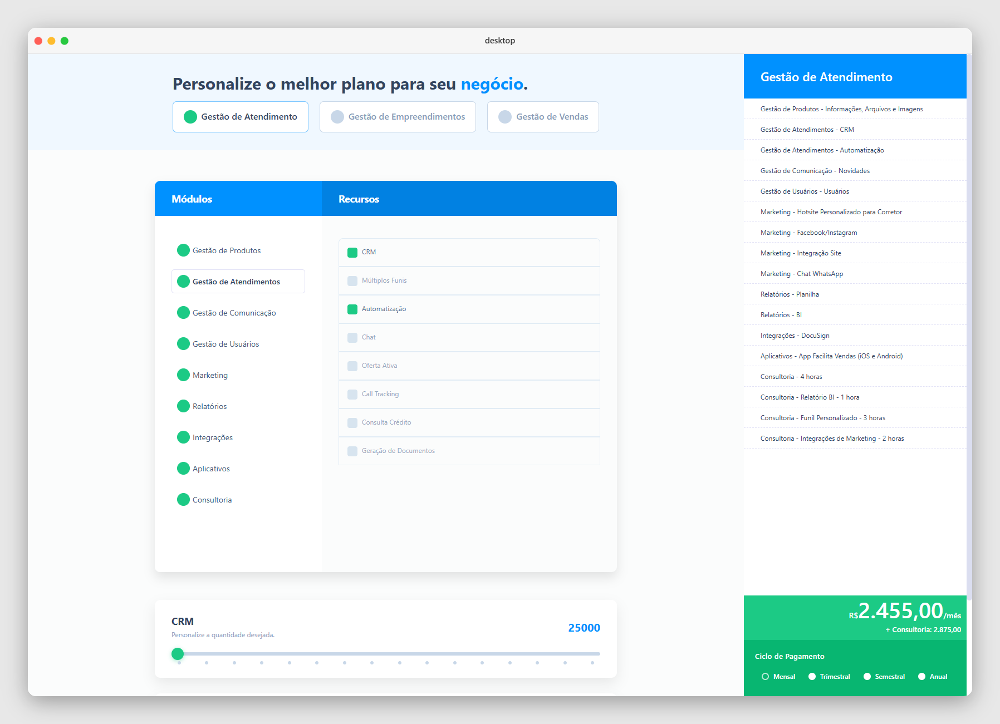
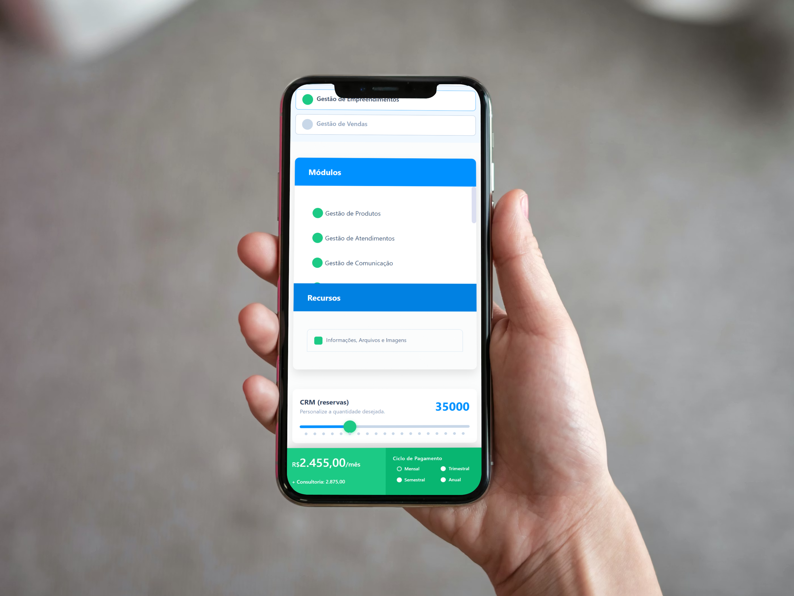

# Pricing Builder — Facilita


> Demo: https://pricing-builder-from-sheet.netlify.app

---

## Sobre o projeto

O **Pricing Builder** é uma interface interativa de montagem de planos e precificação. A partir de uma planilha configurada pelos times de negócio, a aplicação monta dinamicamente módulos, itens e condições de pagamento — permitindo que o usuário final componha e visualize o valor total do seu plano em tempo real.

O grande diferencial da arquitetura é que **toda a configuração de preços, módulos e descontos fica em uma planilha**, não no código. Pessoas não-técnicas (produto, vendas, CS) podem atualizar valores, adicionar módulos ou mudar condições de pagamento simplesmente editando as células da planilha, sem nenhum deploy ou intervenção no repositório.

---

## Como funciona

```
Planilha (Google Sheets)
        │
        ▼
  API JSON via Sheety
  (ou Sheet2API / SheetDB / Google Sheets API)
        │
        ▼
  Axios consome o endpoint
        │
        ▼
  Pinia Store normaliza e distribui os dados
        │
        ▼
  Interface Vue.js renderiza módulos,
  itens, ranges e sidebar de totais
```

1. **Planilha como fonte de verdade** — a planilha contém abas com módulos, itens, preços unitários, valores de implantação e descontos por ciclo de pagamento.
2. **Sheety (ou similar) expõe a planilha como API REST** — uma requisição GET retorna o JSON completo com toda a configuração.
3. **A store Pinia** recebe esse JSON, calcula totais, aplica descontos e mantém o estado de quais itens foram selecionados.
4. **Os componentes Vue** renderizam a lista de módulos, os itens de cada módulo, os inputs de range (quantidade de usuários, CRM etc.) e a sidebar com o resumo financeiro.

---

## Screenshots

### Desktop



### Mobile



---

## Estrutura do JSON

O endpoint retorna um objeto com 4 chaves principais: discounts, modules, plans e compare.

```json
{
  "discounts": [
    { "name": "Mensal", "label": "mês", "value": 0 }
  ],
  "modules": {
    "gestao_de_produtos": {
      "title": "Gestão de Produtos",
      "items": {
        "chave_do_item": {
          "nome": "...",
          "nome_completo": "Módulo - Nome do item",
          "preco": "200.00",
          "preco_unitario": "0.00",
          "implantacao": "0.00",
          "limite": "1/3/50/5",
          "label_total": "empreendimento"
        }
      }
    }
  },
  "plans": {
    "gestao_de_atendimento": {
      "title": "Gestão de Atendimento",
      "items": ["chave_do_item", "outro_item"]
    }
  },
  "compare": [
    ["FEATURE", "BÁSICO", "START", "LIGHT", "PREMIUM", "CORPORATE"],
    ["Valor Mensal", "R$ 0,00", "R$ 250,00", "R$ 750,00", "R$ 1.500,00", "R$ 3.500,00"]
  ]
}
```
| Campo | Descrição |
|---|---|
| `discounts[].value` | Percentual de desconto para aquele ciclo de pagamento |
| `modules.<chave>.title` | Nome legível do módulo exibido na interface |
| `items.<chave>.nome` | Nome curto do item |
| `items.<chave>.nome_completo` | Nome completo no formato `"Módulo - Item"` |
| `items.<chave>.preco` | Preço fixo mensal |
| `items.<chave>.preco_unitario` | Preço por unidade adicional (usado com inputs de range) |
| `items.<chave>.implantacao` | Valor de implantação único (consultoria) |
| `items.<chave>.limite` | Limites por tier separados por `/` (ex: `"1/3/50/5"`), ou `"-"` se não aplicável |
| `items.<chave>.label_total` | Unidade de medida exibida no resumo (`"empreendimento"`, `"usuário"` etc.) |
| `plans.<chave>.items` | Array de chaves referenciando itens em `modules.*.items` |
| `compare` | Array de arrays para montar a tabela comparativa dos 5 planos fixos |

Cada item também pode conter chaves de plano (`gestao_de_atendimento`, `gestao_de_empreendimentos`, `gestao_de_vendas`) cujo valor indica se o item está disponível naquele plano (`"Ilimitado"`, `"+"`) ou não (`"-"`).

---

## Como rodar localmente

**Pré-requisitos:** Node.js 16+ e npm (ou yarn).

```bash
# 1. Clone o repositório
git clone <url-do-repo>
cd pricing-builder-from-sheet

# 2. Instale as dependências
npm install

# 3. Suba o servidor de desenvolvimento
npm run serve
```

A aplicação estará disponível em `http://localhost:8080`.

Para gerar o build de produção:

```bash
npm run build
```

Os arquivos otimizados serão gerados na pasta `dist/`.

---

## Como configurar a planilha de origem

### 1. Monte a planilha

Crie uma planilha no Google Sheets seguindo a estrutura de colunas documentada acima. Cada linha representa um item de módulo, com colunas para `preco`, `preco_unitario`, `implantacao` e uma coluna por plano disponível.

### 2. Exponha como API JSON

Você tem algumas opções:

| Ferramenta | Como usar |
|---|---|
| **[Sheety](https://sheety.co)** | Conecte a planilha, copie a URL gerada. Gratuito para projetos pequenos. |
| **[Sheet2API](https://sheet2api.com)** | Similar ao Sheety, com mais opções de filtragem. |
| **[SheetDB](https://sheetdb.io)** | Alternativa com suporte a operações CRUD. |
| **Google Sheets API** | Solução oficial do Google; requer autenticação OAuth e mais configuração, mas sem limites de uso. |

### 3. Aponte o projeto para o novo endpoint

Abra `src/plugins/axios.js` e substitua o `baseURL` pela URL gerada na etapa anterior:

```js
// src/plugins/axios.js
import axios from 'axios'

axios.defaults.baseURL = 'https://api.sheety.co/seu-usuario/sua-planilha/sheet1'
```

### 4. Substitua o mock pelos dados reais

Em `src/App.vue`, o `onMounted` atualmente carrega os dados do arquivo `src/mocks/mockData.js`. Para consumir a API real, substitua por uma chamada axios:

```js
// Antes (mock local)
onMounted(() => {
  store.setResponseData(mockData)
  apiLoaded.value = true
})

// Depois (API real)
onMounted(async () => {
  const { data } = await axios.get('/')
  store.setResponseData(data)
  apiLoaded.value = true
})
```

---

## Tecnologias utilizadas

| Tecnologia | Versão | Papel |
|---|---|---|
| [Vue.js](https://vuejs.org) | 3.x (Composition API) | Framework de UI |
| [Pinia](https://pinia.vuejs.org) | 2.x | Gerenciamento de estado global |
| [Axios](https://axios-http.com) | 1.x | Cliente HTTP para consumo da API |
| [Vue CLI](https://cli.vuejs.org) | 5.x | Toolchain de build (Webpack) |
| [Sheety](https://sheety.co) *(ou similar)* | — | Transforma Google Sheets em API REST |
| Google Sheets | — | Fonte de dados editável por não-técnicos |
